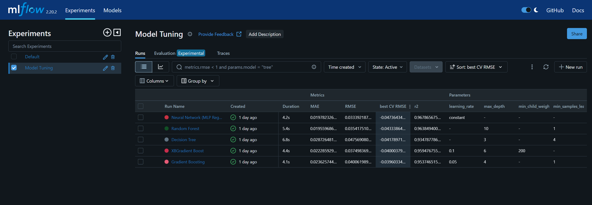

# Flight Price Prediction Using Scikit-learn and MLflow

I love traveling and needed a regression problem for my portfolio. Ultimately, as a forward-thinker, I decided to try my hand at predicting flight prices. I figured that, perhaps, in the future, this knowledge could help me get the best bang for my buck.

For this project, I first did exploratory data analysis, where I identified imbalances in the data, non-linear relationships between features and the target variable, and analysed outliers and possible biases.

Taking the information gathered in this phase, I pre-processed the data and built a model tuning an logging pipeline. Then, I experimented with multiple regression models to find the best one.

To track my experiments efficiently, I used MLflow. It allowed me to log model parameters, metrics, and artifacts, enabling seamless comparison of model performance. Additionally, it streamlines access to model checkpoints - a feature that will surely come in handy the next time I plan my travels.

# Exploratory Data Analysis

The dataset used for this project was obtained from [Kaggle](https://www.kaggle.com/datasets/shubhambathwal/flight-price-prediction). To better understand the data distribution, patterns and relationships, I performed EDA. 

### Features

1) **Airline**: The name of the airline company is stored in the airline column. It is a categorical feature having 6 different airlines.

2) **Flight**: Flight stores information regarding the plane's flight code. It is a categorical feature.
3) **Source City**: City from which the flight takes off. It is a categorical feature having 6 unique cities.
4) **Departure Time**: This is a derived categorical feature obtained created by grouping time periods into bins. It stores information about the departure time and have 6 unique time labels.
5) **Stops**: A categorical feature with 3 distinct values that stores the number of stops between the source and destination cities.
6) **Arrival Time**: This is a derived categorical feature created by grouping time intervals into bins. It has six distinct time labels and keeps information about the arrival time.
7) **Destination City**: City where the flight will land. It is a categorical feature having 6 unique cities.
8) **Class**: A categorical feature that contains information on seat class; it has two distinct values: Business and Economy.
9) **Duration**: A continuous feature that displays the overall amount of time it takes to travel between cities in hours.
10) **Days Left**: This is a derived characteristic that is calculated by subtracting the trip date by the booking date.
11) **Price**: Target variable stores information of the ticket price.

### **Observations**

- **Features were neither encoded nor scaled initially.**
- The price distribution was **highly skewed** and **bimodal** due to differing price structures for economy and business classes. When segmented by class, prices show a bell-shaped **distribution**.
- The Linear Regression residual plot shows a **clustering pattern**, explained by the two distinct classes.
- A Correlation Heatmap shows:
    - High correlation between **price and class** as well as **flight name** and **source**.
    - Notably, **no correlation** between **number of layovers** and **duration**, suggesting layovers do not impact flight duration.
- The majority of flights (~70%) are from two airlines:
    - **Air India** and **Vistara** – the only airlines offering business class, leading to data imbalance.
- **80% of flights** have only **one stop**, contributing to an unbalanced distribution.
- **Outliers** are extreme high-price flights, predominantly from **Vistara**, suggesting potential premium pricing or dynamic pricing strategies.

### Data visualization

Histograms; Box, Scatter and violin plots for the data; heatmap for corelation; other descriptive statistics. 

### **Possible Next Steps**

- **Log-transform** the price variable to reduce skewness and outlier impact.
- Re-evaluate the **Flight** feature's importance and possibly remove it to eliminate multicollinearity.
- **Address class imbalance**:
    - **Train separate models** for economy and business classes.
    - Use **resampling techniques** (for class and stops) to improve model performance.
- **Investigate Vistara's pricing strategy** to confirm premium positioning.
- **Handle outliers** by either removing or treating them based on model impact.

# Data Pre-processing

The data was already cleaned, so:

- There were no missing values.
- No additional feature engineering was required, as date-related features were already processed (e.g., date separated from time of day, date of booking converted to days left until flight, etc.), number of stops were already split into ranges, etc...

The pre-processing conducted consisted of: 

- **One-hot encoding** categorical features.
- **Min-Max Scaling** numerical features.
- **Train-Test Split**: Split the dataset into 80% training and 20% testing data.

For easy processing I built a data pipeline using the *sklearn pipeline* class.

# Model Selection and Tuning

Since the data exhibited non-linear relationships, I experimented with several non-linear regression models:

1. **Decision Tree Regressor**
2. **Random Forest Regressor**
3. **Gradient Boosting Regressor**
4. **XGBoost** 
5. **MLP Regressor**

Linear Regression wasn’t used because the data didn’t fulfil the linear regression assumptions and SVM wasn’t used because the dataset has a large size. 

For tuning each model, the parameters and their possible range of values were detailed and then Cross-validation was used in combination with random search to find the best parameter configuration for each model type.

For the search, the scoring metric chosen was RMSE because it is interpretable and penalizes large errors, which is desirable for the task of price prediction.

## **Experiment Tracking using MLflow**

To track my experiments and compare model performance I used **MLflow**, more specifically, I used it for:

- **Logging Parameters and Metrics**: Recorded hyperparameters (e.g., learning rate, max depth) and evaluation metrics like MAE, RMSE, and R² for each model.
- **Comparing Runs**: MLflow's interface allowed me to compare different runs and easily identify the best model based on RMSE and R².
- **Artifact Logging**: Saved trained model files.

## **Model Evaluation and Results**

I evaluated each model using the following metrics:

- **Mean Absolute Error (MAE)**: Measures average absolute errors.
- **Root Mean Squared Error (RMSE)**: Penalizes larger errors more heavily.
- **R² Score**: Indicates the proportion of variance explained by the model.

### **Performance Comparison**

| Model | MAE | RMSE | R² |
| --- | --- | --- | --- |
| Decision Tree Regressor | 0.0287 | 0.0476 | 0.9347 |
| Gradient Boost Regressor | 0.0236 | 0.0401 | 0.9537 |
| XGBoost Regressor | 0.0223 | 0.0375 | 0.9594 |
| Random Forest Regressor | <ins>0.0196</ins> | 0.0354 | 0.9638 |
| Neural Net (MLP Regression) | 0.0198 | <ins>0.0334</ins> | <ins>0.9679</ins> |

### **Best Model**

The **Neural Network (MLP Regressor)** was the best-performing model, achieving the lowest RMSE and highest R² score. This indicates that it effectively captured non-linear patterns and complex interactions between features while maintaining good generalization.

# Python Libraries

- Visualization: [matplotlib](https://matplotlib.org/), [seaborn](https://seaborn.pydata.org/)
- Data handling: [pandas](https://pandas.pydata.org/docs/index.html), [NumPy](https://numpy.org/doc/2.1/index.html)
- ML: [Scikit-learn](https://scikit-learn.org/stable/)
- Experiment Tracking: [MLflow](https://mlflow.org/)

# Conclusions

This project offered valuable experience in non-linear regression modeling and data exploration. EDA uncovered patterns and imbalances that informed my choice of advanced models like Random Forest, XGBoost, and Neural Networks – the last of which delivered the best results.

MLflow made tracking experiments and comparing model performance a breeze, teaching me the value of experiment logging and management.

Possible challanges were identified as the data imbalance in airlines and ticket classes, but the models proved capable of handling it. Future improvements could involve resampling techniques and training separate models for each class. 

Overall, this project enhanced my EDA and regression modeling skills and improved my experiment tracking workflow.

